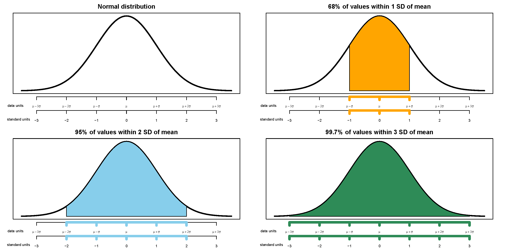

# Percentiles for Normal Distributions (Empirical Rule) {.unnumbered}






```{r}
#| label: fig-normal-cdf-def-appendix
#| echo: false
#| fig-cap: "The Normal(0, 1) cdf. Provides the cdf for any Normal distribution if the variable is measured in *standard deviations from the mean*. It's the same cdf in both figures just with different values highlighted."
#| fig-subcap: 
#|   - "Percentiles highlighted in 0.5 increments of standard deviations from the mean"
#|   - "Deciles highligted in terms of standard deviations from the mean"
#| layout-ncol: 2

normal_m_increments = data.frame(x = seq(-3, 3, 0.5)) |>
  mutate(p = pnorm(x))

ggplot(normal_m_increments,
  aes(x = x, y = p)) +
  stat_function(fun = function(x) pnorm(x),
                color = "skyblue", linewidth = 1.2) +
  # vertical dashed lines
  geom_segment(
    data = normal_m_increments,
    aes(x = x, xend = x, y = -Inf, yend = p),
    linetype = "dashed", color = "gray40", inherit.aes = FALSE
  ) +
  # horizontal dashed lines
  geom_segment(
    data = normal_m_increments,
    aes(x = -Inf, xend = x, y = p, yend = p),
    linetype = "dashed", color = "gray40", inherit.aes = FALSE
  ) +
  scale_y_continuous(limits = c(0, 1), breaks = seq(0, 1, 0.1)) +
  scale_x_continuous(limits = c(-3.5, 3.5), breaks = seq(-3.5, 3.5, 0.5)) +
  theme_bw() +  # removes gray background, keeps gridlines
  theme(panel.grid.major = element_blank(),
        panel.grid.minor = element_blank()) +
  labs(x = "z (standard deviations from mean)",
       y = "cdf(z)")


normal_p_increments = data.frame(p = seq(0.1, 0.9, 0.1)) |>
  mutate(x = qnorm(p))

ggplot(normal_p_increments,
  aes(x = x, y = p)) +
  stat_function(fun = function(x) pnorm(x),
                color = "skyblue", linewidth = 1.2) +
  # vertical dashed lines
  geom_segment(
    data = normal_p_increments,
    aes(x = x, xend = x, y = -Inf, yend = p),
    linetype = "dashed", color = "gray40", inherit.aes = FALSE
  ) +
  # horizontal dashed lines
  geom_segment(
    data = normal_p_increments,
    aes(x = -Inf, xend = x, y = p, yend = p),
    linetype = "dashed", color = "gray40", inherit.aes = FALSE
  ) +
  scale_y_continuous(limits = c(0, 1), breaks = seq(0, 1, 0.1)) +
  scale_x_continuous(limits = c(-3.5, 3.5), breaks = seq(-3.5, 3.5, 0.5)) +
  theme_bw() +  # removes gray background, keeps gridlines
  theme(panel.grid.major = element_blank(),
        panel.grid.minor = element_blank()) +
  labs(x = "z (standard deviations from mean)",
       y = "cdf(z)")

```


```{r}
#| label: tbl-normal-cdf-def-appendix
#| echo: false
#| warning: false
#| tbl-cap: "Select percentiles for a Normal distribution in terms of standard deviations from the mean"
#| tbl-subcap: 
#|   - "In 0.5 increments of standard deviations from the mean"
#|   - "Deciles and quantiles as standard deviations from the mean"
#| layout-ncol: 2

z = seq(-3.5, 3.5, 0.5)

p = pnorm(z)

data.frame(p = paste(pmax(0.02, pmin(round(100 * p, 1), 99.98)), "%", sep = ""),
           z = paste(format(z, digits = 1), "")) |>
  kbl(col.names = c("Percentile", "Standard deviations from the mean"),
      align = c('r', 'r')) |>
  kable_styling(fixed_thead = TRUE)


p = sort(c(0.01, 0.05, 0.95, 0.99, 0.25, 0.75, seq(0.1, 0.9, 0.1)))

z = qnorm(p)

data.frame(p = paste(round(100 * p, 1), "%", sep = ""),
           z = paste(format(z, digits = 2), "")) |>
  kbl(col.names = c("Percentile", "Standard deviations from the mean"),
      align = c('r', 'r')) |>
  kable_styling(fixed_thead = TRUE)

```


```{r}
#| label: fig-normal-cdf-spinner-appendix
#| echo: false
#| warning: false
#| fig-cap: "A continuous *Normal(0, 1)* spinner. The same spinner is displayed in all figures, with different features highlighted. This spinner can be used to simulate values from any Normal distribution by simulating values in terms of standard deviations from the mean."
#| fig-subcap: 
#|   - "Each sector represents an interval with 5% probability"
#|   - "Each sector represents an interval with 1% probability"
#|   - "Values labeled in increments of 0.5 standard deviations from the mean"
#| layout-ncol: 3

mu = 0
sigma = 1
min_x = -3.0
max_x = 3.0

n = 20

xp <- data.frame(
  x = (0:(n-1))/n,
  p = rep(1/n, n)
  )

cdf = c(0, cumsum(xp$p))

plotp = (cdf[-1] + cdf[-length(cdf)]) / 2
  
spinner1 <- ggplot(xp, aes(x="", y=p, fill=x))+
  geom_bar(width = 1, stat = "identity", color="black", fill="white") + 
  coord_polar("y", start=0) +
  theme_void() +
  # plot the possible values on the outside
  scale_y_continuous(breaks = xp$x, labels=c("...|...", round(mu + sigma * qnorm(xp$x[-1]), 2))) +
  # theme(axis.text.x=element_text(size=12, face="bold"))
    theme(axis.text.x=element_text(size=10, face = "bold", angle=c(0, 90-180/10*(1:9), -90-180/10*(10:19))))

spinner1


n = 100

xp <- data.frame(
  x = (0:(n-1))/n,
  p = rep(1/n, n)
  )

cdf = c(0, cumsum(xp$p))

plotp = (cdf[-1] + cdf[-length(cdf)]) / 2
  
spinner2 <- ggplot(xp, aes(x="", y=p, fill=x))+
  geom_bar(width = 1, stat = "identity", color="black", fill="white") + 
  coord_polar("y", start=0) +
  theme_void() +
  # plot the possible values on the outside
  scale_y_continuous(breaks = xp$x, minor_breaks = (0:99)/100, labels=c("...|...", round(mu+ sigma * qnorm(xp$x[-1]), 2))) +
  theme(axis.text.x=element_text(size=7, angle=c(0, 90-180/50*(1:49), -90-180/50*(50:99))))

spinner2


x = c("","<-2", seq(-1.5, 1.5, 0.5), ">2")
p = c(pnorm(-2), pnorm(seq(-1.5, 2.0, 0.5)) - pnorm(seq(-2.0, 1.5, 0.5)), 1-pnorm(2))

xp <- data.frame(x, p)

cdf = c(0, cumsum(xp$p))


plotp = (cdf[-1] + cdf[-length(cdf)]) / 2
  
spinner3 <- ggplot(xp, aes(x="", y=p, fill=x))+
  geom_bar(width = 1, stat = "identity", color="black", fill="white", linetype=1) + 
  # coord_polar("y", start=0) +
  coord_curvedpolar("y", start = 0) +
  theme_void() +
  # plot the possible values on the outside
  scale_y_continuous(breaks = cdf[-c(1, length(cdf))], labels=seq(-2, 2, 0.5)) +
  # theme(axis.text.x=element_text(angle=c(90-180/50*(0:49), -90-180/50*(50:99)), size=8)) +
  theme(axis.text.x=element_text(angle = 0, size=12)) +
  # annotate(geom="segment", y=(0:19)/20+0.000, yend = (0:19)/20+0.000,
  #          x=1.48, xend= 1.52) +
  # plot the probabilities as percents inside
    geom_text(aes(y = plotp,
                label = percent(p, accuracy = 0.1)), size=4, color=c(NA, rep("black",8), rep(NA, 1)))

spinner3


```


The empirical rule is often described in terms of "within [blank] standard deviations of the mean" as in the following:

-   38% of values are within 0.5 standard deviations of the mean
-   50% of values are withing 0.67 standard deviations of the mean
-   68% of values are within 1 standard deviation of the mean
-   87% of values are within 1.5 standard deviations of the mean
-   95% of values are within 2 standard deviations of the mean
-   99% of values are within 2.6 standard deviations of the mean
-   99.7% of values are within 3 standard deviations of the mean
-   99.99% of values are within 4 standard deviations of the mean


{width=100%}


